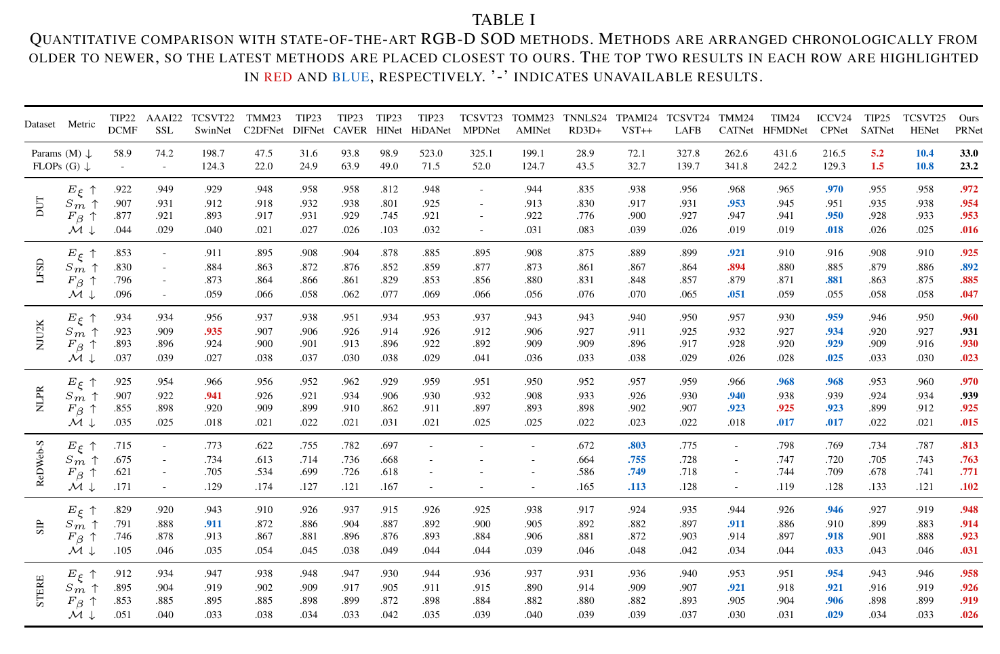
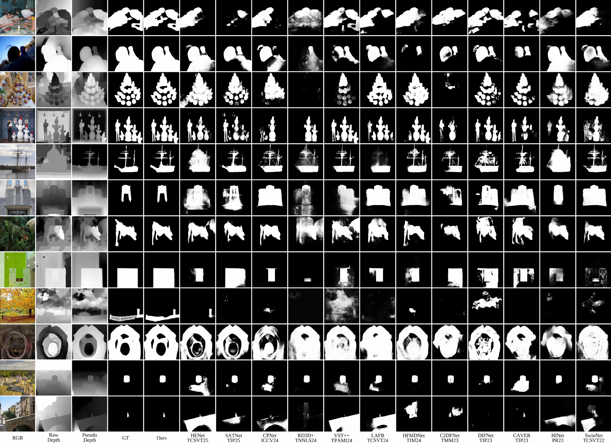

# PRNet

Official repository for **PRNet: Prior-Guided Rectification Network for RGB-D Salient Object Detection**.

Source code, pretrained models, and prediction maps will be released upon acceptance/publication.

## Results

### Quantitative SOTA Comparison

The table below reports the final RGB-D SOD comparison on seven benchmarks. Red and blue values indicate the best and second-best results in each row, respectively.

  

### Qualitative SOTA Comparison

  

